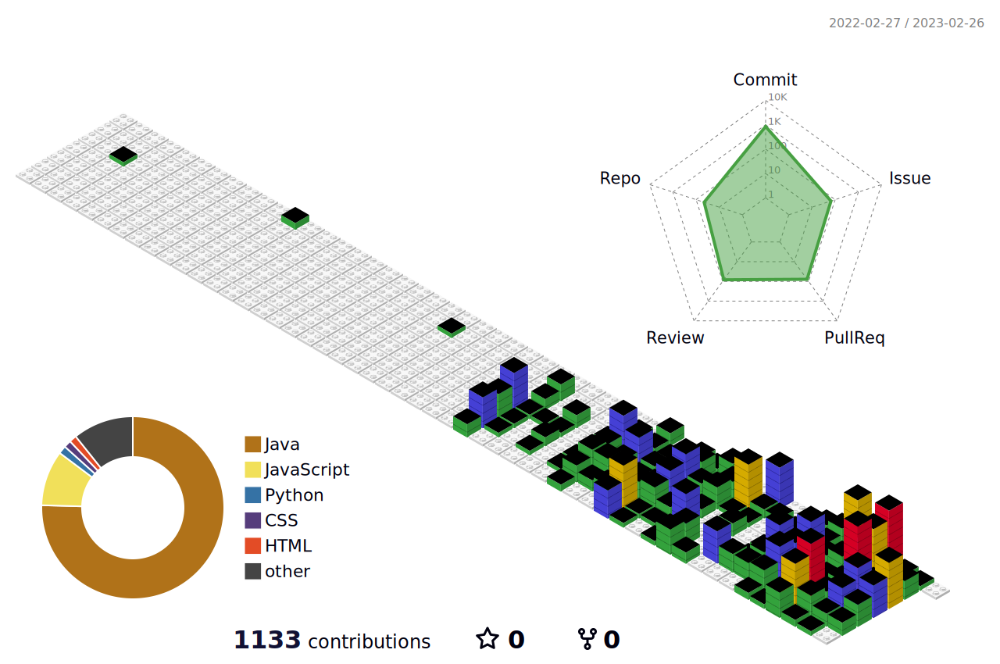

<h3 align="center">👩‍💻 STACK 👩‍💻</h3>

---

 

<!-- Tech Stack 부분 -->
<h3 align="center">📚 BackEnd Tech Stack 📚</h3>

 

  </a>&nbsp 
  </a>&nbsp 
  </a>&nbsp
   
<!--   </a>&nbsp 
  </a>&nbsp 
  </a>&nbsp 
    -->

 <h3 align="center">💽 DataBase Tech Stack 💽</h3>

 

  </a>&nbsp 
  </a>&nbsp 
  </a>&nbsp 
   
  </a>&nbsp
  </a>&nbsp
  </a>&nbsp
   

  

 <h3 align="center">🛠 Tools 🛠</h3>

 

  
  </a>&nbsp 
  </a>&nbsp 
  </a>&nbsp 
  </a>&nbsp 
   
  </a>&nbsp 
  </a>&nbsp 
  </a>&nbsp 
  </a>&nbsp 
   
  </a>&nbsp 
  </a>&nbsp 
  </a>&nbsp 
   

 
 
<h3 align="center">🧸 About Me 🧸</h3>

---

<!-- ME (Contact 관련) -->
 
<h3 align="center"> 📮 Contact 📮 </h3>

  &nbsp
  

 

  
<!-- 티스토리 포스트 -->
<!--  -->
  

<h2></h2>
 

  
<!-- github stats -->

<!--  -->

 
  
<!-- 3D 레고 블럭 (잔디) -->
<!--  -->
  
  

<!-- 깃허브 조회수 -->
 

  

<!-- 깃허브 팔로워 보여주기 -->
<!--  -->

